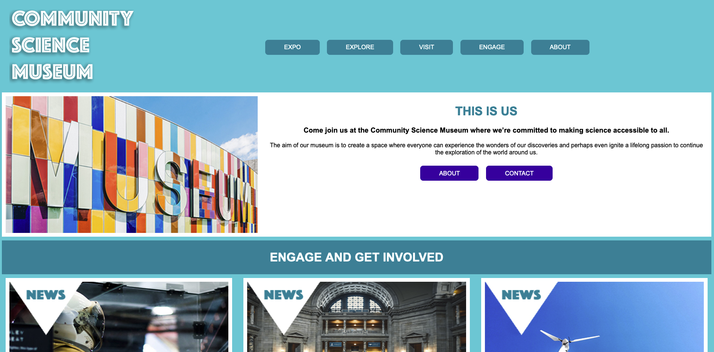

# Semester project1 / Community Science Museum



In this project I am developing a website for the new science museum opening in my town. It´s called Community Science Museum and the target audience is primary- and middle school pupils, and familys with small children. The website should be informative and and engaging, encouraging viewers to visit. The website should be responsive and easy to navigate over various devices.

## Description (Taken from the brief handed out for the assignment)

Based on the first-semester curriculum, the semester project should reflect the student’s creative and technical knowledge and skills. This includes design principles, project management, communication technology, and development with HTML/CSS.
Target Audience & Design: The target audience should be carefully considered, and the proposed design should reflect this. A website prototype should be made using your chosen software (Adobe XD, Figma etc.)
Final Product: The site should be tested on a variety of devices before final delivery. The student is responsible for setting up their web host or using Netlify to deploy the site.

- Trello
- Figma
- Hotjar
- Netlify

## Requirements

1. The site must have a design that appeals to the target audience.
2. The site must have at least 4-6 pages.
3. Compositional principles, typography, and colour schemes must be considered.
4. Your HTML should be semantic and neatly indented.
5. The site should use external CSS style sheets which follow the DRY principle.
6. The site should download quickly and not be overly “heavy”. Images should be at most 200kb.
7. The site should consider WCAG principles, especially regarding hierarchy, navigation, and colour usage.
8. The site should be responsive, attractive, and easy to use on various devices.
9. The site should show consideration for content strategy and SEO (consider your use of meta tags and alt text).
10. The GitHub repo for the project should be set to private. You do not need to submit this with your project.

## Built With

- [Figma](https://www.figma.com)
- HTML
- CSS

## Getting Started

### Installing

1. Clone the repo:

```bash
git clone git@github.com:KineOnes/2022-12-17_semester_project1_Kine-Ones-Verhaaf_fp.git
```

2. View on Netlify
   [Netlify](https://radiant-seahorse-eaf599.netlify.app)

### Running

Clone the repo, open in Vscode. Right click on the index.html and open in Live Server.

## Contributing

Open a pull request and review the code.

## Contact

[My Behance Profile](https://www.behance.net/kineonesv)

[My Github Profile](https://github.com/KineOnes)
